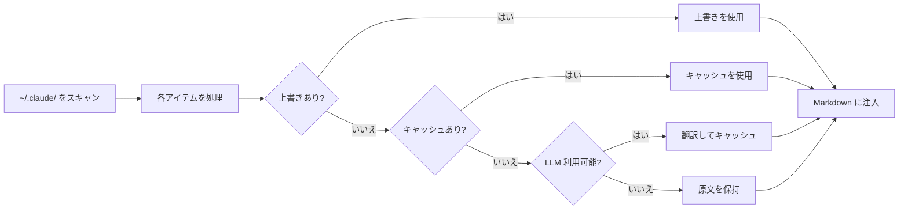
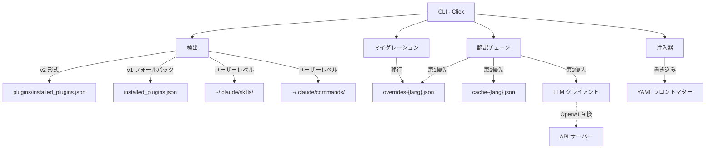

<div align="center">

# Claude Translator

**Claude Code 向け多言語プラグイン説明翻訳ツール**

[](LICENSE) [](CHANGELOG.md) [](https://www.python.org/) [](https://github.com/debug-zhuweijian/claude-translator/releases)

**[English](README.md)** | **[中文](README.zh-CN.md)** | **[日本語](README.ja.md)** | **[한국어](README.ko.md)**

</div>

---

Claude Code には数百のコミュニティプラグインが存在しますが、その説明はほぼすべて英語で書かれています。中国語、日本語、韓国語で作業しているチームにとって、未翻訳の説明を毎日読むことになります。

Claude Translator はこの問題を解決します: **スキャン -> 翻訳 -> 注入**。コマンド一つで、すべてのプラグイン説明があなたの言語になります。

## 目次

- [なぜ Claude Translator が必要か](#なぜ-claude-translator-が必要か)
- [何ができるか](#何ができるか)
- [仕組み](#仕組み)
- [前提条件](#前提条件)
- [クイックスタート](#クイックスタート)
- [使用チュートリアル: インストールから完全翻訳まで](#使用チュートリアル-インストールから完全翻訳まで)
- [設定](#設定)
- [スキャン対象](#スキャン対象)
- [機能一覧](#機能一覧)
- [CLI リファレンス](#cli-リファレンス)
- [アーキテクチャ](#アーキテクチャ)
- [対応言語](#対応言語)
- [更新履歴](#更新履歴)
- [開発](#開発)
- [コントリビュート](#コントリビュート)
- [ライセンス](#ライセンス)

## なぜ Claude Translator が必要か

**問題点:** Claude Code に 50 以上のプラグインをインストールしています。それぞれに英語の `description` フィールドがあります。Claude Code がどのプラグインを使用するか決定する際、その説明を読み取ります。説明が母国語以外の言語で書かれていると、コンテキストを失います。CJK 言語で作業している場合、これは日常的な摩擦です。

**解決策:** Claude Translator は `~/.claude/` ディレクトリ内のすべてのプラグイン、スキル、コマンド、エージェントをスキャンし、説明をターゲット言語に翻訳して、Markdown フロントマターに直接注入します。手動編集は不要。管理すべきファイルもありません。`sync` を実行するだけで、すべてが翻訳されます。

**翻訳しないもの:** スキルやエージェントの本文全体は翻訳しません。YAML フロントマターの `description` フィールドのみを対象とします。このフィールドは、Claude Code がプラグインの選択と表示に使用するものです。

## 何ができるか

変換前:

```yaml
---
name: brainstorm
description: Brainstorm ideas collaboratively
---
# Brainstorm
```

変換後:

```yaml
---
name: brainstorm
description: 協力してアイデアを出すブレインストーミング
---
# Brainstorm
```

元の英語は保持されます。翻訳された説明はフロントマターに直接注入されるため、次回の起動時に Claude Code が即座に反映します。

## 仕組み



検出された各アイテムに対して、翻訳チェーンは 4 つのソースを順に試行します:

1. **ユーザー上書き** -- `overrides-{lang}.json` に保存された手動翻訳（最優先）
2. **キャッシュ** -- 過去に LLM で翻訳済みのもの、`cache-{lang}.json` に保存
3. **LLM** -- 設定されたモデルを呼び出して翻訳し、結果をキャッシュ
4. **原文** -- LLM が利用できない場合、英語のテキストをそのまま保持

## 前提条件

| 依存関係 | バージョン | インストール | 確認 |
|------------|---------|---------|--------|
| Python | 3.10+ | [python.org](https://www.python.org/) または `winget install Python.Python.3.12` | `python --version` |
| pip | 最新版 | Python に同梱 | `pip --version` |
| LLM API キー | 任意 | OpenAI、Ollama、vLLM、または OpenAI 互換エンドポイント | -- |

> **OpenAI キーをお持ちでない場合:** Claude Translator は Ollama や vLLM を通じてローカルモデルでも動作します。下記の[ローカルモデルの使用](#ローカルモデルの使用)を参照してください。

## クイックスタート

### 1. インストール

```bash
git clone https://github.com/debug-zhuweijian/claude-translator.git
cd claude-translator
pip install .
```

確認:

```
$ claude-translator --version
claude-translator, version 0.2.0
```

### 2. 初期化

ターゲット言語を設定します。これにより `~/.claude/translations/config.json` が作成されます:

```bash
$ claude-translator init --lang zh-CN
Created config at C:\Users\you\.claude\translations\config.json (target: zh-CN)
```

### 3. 検出

翻訳可能なアイテムを確認します。ユーザーレベルのスキル/コマンドとインストール済みプラグインの**両方**をスキャンします:

```
$ claude-translator discover
Scanning C:\Users\you\.claude ...
Found 440 translatable items (target: zh-CN)
  ok [user] user.skill:academic-writing
  ok [user] user.skill:brainstorming
  ok [user] user.command:commit
  ok [plugin] plugin.superpowers.skill:brainstorm
  ok [plugin] plugin.superpowers.skill:tdd-guide
  ok [plugin] plugin.compound-engineering.skill:code-review
  ok [plugin] plugin.everything-claude-code.agent:build-error-resolver
  ok [plugin] plugin.everything-claude-code.skill:e2e
  ...
```

各行には、ステータス（`ok` = フロントマターあり、`no` = フロントマターなし）、スコープ（`[user]` または `[plugin]`）、正規 ID が表示されます。

### 4. 翻訳

翻訳を実行します。各アイテムに対して 4 段階のフォールバックを使用します:

```
$ claude-translator sync
Scanning C:\Users\you\.claude ...
Translating 440 items to zh-CN ...
  [override] plugin.codex.agent:codex-rescue
  [cache] plugin.superpowers.skill:brainstorm
  [llm] plugin.compound-engineering.skill:code-review
  [llm] plugin.everything-claude-code.agent:build-error-resolver
  [skip] user.skill:my-custom-skill
  ...
Sync complete.
```

ラベルの意味:
- `[override]` -- 手動の `overrides-zh-CN.json` から取得
- `[cache]` -- 過去に LLM で翻訳済み、`cache-zh-CN.json` に保存
- `[llm]` -- LLM で新規翻訳し、キャッシュに保存
- `[skip]` -- 変更不要（既に翻訳済み、または空）

### 5. 検証

同期後のカバレッジを確認します:

```
$ claude-translator verify
  MISSING: plugin.new-tool.skill:deploy
Coverage: 439/440 (99.8%) -- 1 missing
```

---

## 使用チュートリアル: インストールから完全翻訳まで

### シナリオ: Windows で Claude Code に 50 のプラグインを設定したばかり

Claude Code をインストールし、研究、執筆、開発用のプラグインを追加しました。すべて動作しますが、プラグインの説明がすべて英語です。読むスピードを上げるために中国語にしたいと考えています。

#### ステップ 1: インストールと初期化

```
C:\Users\you> git clone https://github.com/debug-zhuweijian/claude-translator.git
C:\Users\you> cd claude-translator
C:\Users\you\claude-translator> pip install .

C:\Users\you\claude-translator> claude-translator init --lang zh-CN
Created config at C:\Users\you\.claude\translations\config.json (target: zh-CN)
```

設定ファイルでターゲット言語を指定します。`init` の実行は一度だけです。

#### ステップ 2: 現在の状態を確認

```
C:\Users\you\claude-translator> claude-translator discover
Scanning C:\Users\you\.claude ...
Found 440 translatable items (target: zh-CN)
  ok [user] user.skill:academic-writing
  ok [user] user.command:commit
  ok [plugin] plugin.superpowers.skill:brainstorm
  ok [plugin] plugin.superpowers.skill:tdd-guide
  ...
```

ユーザースキル、ユーザーコマンド、インストール済みプラグインにわたる 440 アイテム。`ok` ステータスは、そのアイテムに翻訳対象の `description` フィールドを含むフロントマターがあることを示します。

#### ステップ 3: LLM を設定

OpenAI API キーをお持ちの場合、`OPENAI_API_KEY` から自動的に取得されます。ローカルモデルを使用する場合:

```
C:\Users\you\claude-translator> set CLAUDE_TRANSLATE_LLM_BASE_URL=http://localhost:11434/v1
C:\Users\you\claude-translator> set CLAUDE_TRANSLATE_LLM_API_KEY=ollama
C:\Users\you\claude-translator> set CLAUDE_TRANSLATE_LLM_MODEL=qwen2.5:7b
```

#### ステップ 4: 翻訳を実行

```
C:\Users\you\claude-translator> claude-translator sync
Scanning C:\Users\you\.claude ...
Translating 440 items to zh-CN ...
  [llm] plugin.superpowers.skill:brainstorm
  [llm] plugin.superpowers.skill:tdd-guide
  [llm] plugin.compound-engineering.skill:code-review
  [llm] plugin.everything-claude-code.agent:build-error-resolver
  [llm] plugin.everything-claude-code.skill:e2e
  ...
Sync complete.
```

各アイテムは LLM で翻訳され、キャッシュされます。次回の実行ではキャッシュされたアイテムが再利用され、新規または変更されたアイテムのみが LLM に送信されます。

#### ステップ 5: 翻訳の修正

LLM が "brainstorm" を "頭脳風暴" と翻訳しましたが、"協力してアイデアを出すブレインストーミング" の方が好みです。上書きファイルを編集します:

`C:\Users\you\.claude\translations\overrides-zh-CN.json`:

```json
{
  "plugin.superpowers.skill:brainstorm": "協力してアイデアを出すブレインストーミング"
}
```

再度 `sync` を実行:

```
C:\Users\you\claude-translator> claude-translator sync
  [override] plugin.superpowers.skill:brainstorm
  ...
```

上書き設定が最優先されます。今後の同期で上書きされることはありません。

#### ステップ 6: すべての翻訳が完了しているか確認

```
C:\Users\you\claude-translator> claude-translator verify
Coverage: 440/440 (100.0%) -- 0 missing
```

すべてのプラグイン説明が中国語になりました。Claude Code は翻訳された説明を即座に使用します。

### クイックリファレンス

| やりたいこと | コマンド |
|-------------|---------|
| 初回セットアップ | `claude-translator init --lang zh-CN` |
| 翻訳可能なアイテムを確認 | `claude-translator discover` |
| すべてを翻訳 | `claude-translator sync` |
| 未翻訳のアイテムを確認 | `claude-translator verify` |
| 特定の翻訳を修正 | `overrides-zh-CN.json` を編集して `sync` |
| ターゲット言語を変更 | `claude-translator sync --lang ja` |

---

## 設定

### 設定の優先順位

```
CLI 引数  >  環境変数  >  config.json  >  デフォルト値
```

### 環境変数

| 変数 | 用途 | フォールバック |
|----------|---------|----------|
| `CLAUDE_TRANSLATE_LANG` | ターゲット言語 | config または `zh-CN` |
| `CLAUDE_TRANSLATE_LLM_BASE_URL` | API エンドポイント | `OPENAI_BASE_URL` |
| `CLAUDE_TRANSLATE_LLM_API_KEY` | API キー | `OPENAI_API_KEY` |
| `CLAUDE_TRANSLATE_LLM_MODEL` | モデル名 | `OPENAI_MODEL` または `gpt-4o-mini` |

### データファイル

すべて `~/.claude/translations/` に保存されます:

| ファイル | 用途 |
|------|---------|
| `config.json` | 設定（`init` で作成） |
| `overrides-zh-CN.json` | 手動翻訳（最優先） |
| `cache-zh-CN.json` | LLM 翻訳キャッシュ |

### ローカルモデルの使用

OpenAI キーをお持ちでない場合は、ローカルモデルを使用できます:

```bash
# Ollama
export CLAUDE_TRANSLATE_LLM_BASE_URL="http://localhost:11434/v1"
export CLAUDE_TRANSLATE_LLM_API_KEY="ollama"
export CLAUDE_TRANSLATE_LLM_MODEL="qwen2.5:7b"

# vLLM
export CLAUDE_TRANSLATE_LLM_BASE_URL="http://localhost:8000/v1"
export CLAUDE_TRANSLATE_LLM_MODEL="Qwen/Qwen2.5-7B-Instruct"
```

### 手動上書き

`~/.claude/translations/overrides-zh-CN.json` を編集して翻訳を修正します:

```json
{
  "plugin.superpowers.skill:brainstorm": "協力してアイデアを出すブレインストーミング"
}
```

上書き設定は常に最優先されます。`sync` で上書きされることはありません。

## スキャン対象

| ソース | パス | 例 |
|--------|------|----------|
| ユーザースキル | `~/.claude/skills/**/*.md` | `SKILL.md`、`my-skill.md` |
| ユーザーコマンド | `~/.claude/commands/**/*.md` | `commit.md`、`review.md` |
| プラグインスキル | `<plugin>/skills/**/*.md` | プラグインごとのスキル定義 |
| プラグインコマンド | `<plugin>/commands/**/*.md` | プラグインごとのスラッシュコマンド |
| プラグインエージェント | `<plugin>/agents/**/*.md` | プラグインごとのエージェント定義 |

プラグインレジストリは `~/.claude/plugins/installed_plugins.json`（v2 形式）から読み込まれ、`~/.claude/installed_plugins.json`（v1 形式）にフォールバックします。複数バージョンのプラグインは重複排除され、最新バージョンのみが翻訳されます。

## 機能一覧

| 機能 | 説明 |
|---------|-------------|
| **自動検出** | `~/.claude/` 内のすべてのプラグイン、スキル、コマンド、エージェントをスキャン |
| **4 段階フォールバック** | ユーザー上書き -> キャッシュ翻訳 -> LLM 翻訳 -> 原文 |
| **手動上書き** | `overrides-{lang}.json` で翻訳を個別に調整 |
| **複数バージョンの重複排除** | 同一プラグインの異なるバージョンがある場合、最新版のみ翻訳 |
| **CJK サポート** | 中国語、日本語、韓国語スクリプトの組み込み検出 |
| **OpenAI 互換** | OpenAI、Ollama、vLLM、または互換 API で動作 |
| **CRLF セーフ** | Windows での改行コードを保持。ファイルの破損なし |
| **BOM セーフ** | Windows エディタが追加した UTF-8 BOM マーカーを保持 |
| **レガシーマイグレーション** | 初回実行時に旧形式の翻訳データを自動移行 |
| **設定カスケード** | CLI 引数 -> 環境変数 -> 設定ファイル -> デフォルト値 |
| **Dry Run** | `sync --dry-run` でファイルを書き換えずに変更内容を確認 |

## CLI リファレンス

| コマンド | 説明 |
|---------|-------------|
| `init --lang LANG` | ターゲット言語を設定して config を作成 |
| `discover [--lang LANG]` | 翻訳可能なアイテムとステータスを一覧表示 |
| `sync [--lang LANG] [--dry-run]` | 説明を翻訳してファイルに書き込み |
| `verify [--lang LANG]` | カバレッジを確認し、未翻訳アイテムを報告 |

## アーキテクチャ



## 対応言語

LLM がサポートする任意の言語に対応。組み込みプロンプト対応:

英語 -> 中国語（簡体字/繁体字）/ 日本語 / 韓国語、中国語 -> 日本語 / 韓国語

## 更新履歴

### v0.2.0

- **安全な YAML frontmatter ラウンドトリップ** -- `ruamel.yaml` により引用符、コロン、複数行 description を壊さず更新
- **翻訳パイプラインの強化** -- LLM 出力を注入前にクリーニングし、OpenAI クライアントに timeout/retry を追加、`sync` が失敗を明示的に集計
- **ファイル操作の安全性向上** -- cache / overrides は原子的に保存され、translations ディレクトリは書き込み時のみ作成
- **CLI 運用性の改善** -- `sync --dry-run` を追加し、`verify` は zh/ja/ko の実際の frontmatter を検査

### v0.1.1

- **複数行フロントマターの解析** -- 継続行（インデント付き）が無視されずに正しくキャプチャされるようになりました
- **クォート除去** -- `"quoted"` や `'quoted'` のフロントマター値が適切にアンクォートされます
- **UTF-8 BOM の保持** -- BOM プレフィックス付きのファイルが注入後に BOM を失わなくなりました
- **プラグイン検出の修正** -- レジストリパス（`~/.claude/plugins/`）と v2 形式の解析を修正

### v0.1.0

4 つの CLI コマンド、自動検出、4 段階フォールバック、CJK サポート、OpenAI 互換クライアントを備えた初回リリース。詳細は [CHANGELOG.md](CHANGELOG.md) を参照してください。

## 開発

```bash
pip install -e ".[dev]"
python -m pytest -q
ruff check src/ tests/
```

CLI は `python -m claude_translator` でも実行できます。

## コントリビュート

コントリビュートを歓迎します。

**バグ報告:**
1. `bug` ラベルを付けて Issue を作成
2. 発生したこと、期待した動作、環境（OS、Python バージョン）を記載

**機能提案:**
1. `enhancement` ラベルを付けて Issue を作成
2. ユースケースと、既存機能ではカバーできない理由を記載

**修正の提出:**
1. リポジトリをフォーク
2. ブランチを作成: `git checkout -b fix/your-fix`
3. 変更内容を明記した PR を提出

## ライセンス

[MIT](LICENSE) -- Copyright (c) 2025 debug-zhuweijian
