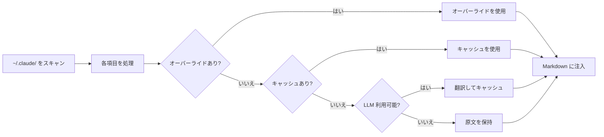
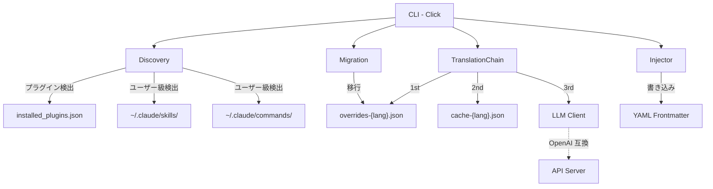

<div align="center">

# Claude Translator

**Claude Code プラグイン説明の多言語翻訳ツール**

[](LICENSE) [](CHANGELOG.md) [](https://www.python.org/)

[English](README.md) | [中文](README.zh-CN.md) | [日本語](README.ja.md) | [한국어](README.ko.md)

</div>

## なぜ Claude Translator が必要か？

Claude Code には何百ものコミュニティプラグインがありますが、その説明はほぼすべて英語です。日本語や中国語、韓国語で作業している場合、未翻訳の説明を毎日読むことになります。

Claude Translator が解決します：**スキャン → 翻訳 → 注入**、すべて自動。コマンド一つで、すべてのプラグイン説明があなたの言語に。

## 何が変わるか

こんな Markdown ファイルが：

```yaml
---
name: brainstorm
description: Brainstorm ideas collaboratively
---
# Brainstorm
```

こうなります：

```yaml
---
name: brainstorm
description: 協力的なブレインストーミングでアイデアを生成
---
# Brainstorm
```

元の英語は保持され、翻訳された説明が frontmatter に直接注入されます。Claude Code がすぐに反映します。

## 仕組み




## クイックスタート

### インストール

```bash
git clone https://github.com/debug-zhuweijian/claude-translator.git
cd claude-translator
pip install .
```

### 初期化

```bash
$ claude-translator init --lang zh-CN
Created config at ~/.claude/translations/config.json (target: zh-CN)
```

### 検出

```bash
$ claude-translator discover
Scanning /home/user/.claude ...
Found 47 translatable items (target: zh-CN)
  ok [plugin] plugin.codex.agent:codex-rescue
  ok [plugin] plugin.superpowers.skill:brainstorm
  no [user] user.skill:my-custom-skill
  ...
```

### 翻訳実行

```bash
$ claude-translator sync
Scanning /home/user/.claude ...
Translating 47 items to zh-CN ...
  [override] plugin.codex.agent:codex-rescue
  [cache] plugin.superpowers.skill:brainstorm
  [llm] plugin.ecc-skills.command:commit
  [skip] user.skill:my-custom-skill
Sync complete.
```

### 検証

```bash
$ claude-translator verify
  MISSING: plugin.new-tool.skill:deploy
Coverage: 46/47 (97.9%) — 1 missing
```

## 機能

| 機能 | 説明 |
|------|------|
| **自動検出** | `~/.claude/` 内のすべてのプラグイン、スキル、コマンド、エージェントをスキャン |
| **4 段階フォールバック** | ユーザーオーバーライド → キャッシュ → LLM 翻訳 → 原文 |
| **手動オーバーライド** | `overrides-{lang}.json` で個別に微調整 |
| **マルチバージョン重複排除** | 同一プラグインの複数バージョンは最新のみ翻訳 |
| **CJK サポート** | 中国語・日本語・韓国語のスクリプト検出を内蔵 |
| **OpenAI 互換** | OpenAI、Ollama、vLLM などで動作 |
| **CRLF セーフ** | Windows で改行コードを保持、ファイルを破損しません |
| **レガシー移行** | 初回実行時に旧形式データを自動移行 |
| **設定カスケード** | CLI 引数 → 環境変数 → 設定ファイル → デフォルト |

## CLI コマンド

| コマンド | 説明 |
|----------|------|
| `init --lang LANG` | 対象言語を指定して設定を作成 |
| `discover [--lang LANG]` | 翻訳可能な項目とステータスを一覧表示 |
| `sync [--lang LANG]` | 翻訳を実行してファイルに書き込み |
| `verify [--lang LANG]` | カバレッジを確認、未翻訳項目を報告 |

## 設定

### 優先度カスケード

```
CLI 引数  >  環境変数  >  config.json  >  デフォルト
```

### 環境変数

| 変数 | 用途 | フォールバック |
|------|------|----------------|
| `CLAUDE_TRANSLATE_LANG` | 対象言語 | 設定ファイルまたは `zh-CN` |
| `CLAUDE_TRANSLATE_LLM_BASE_URL` | API エンドポイント | `OPENAI_BASE_URL` |
| `CLAUDE_TRANSLATE_LLM_API_KEY` | API キー | `OPENAI_API_KEY` |
| `CLAUDE_TRANSLATE_LLM_MODEL` | モデル名 | `OPENAI_MODEL` または `gpt-4o-mini` |

### データファイル

`~/.claude/translations/` に保存：

| ファイル | 用途 |
|----------|------|
| `config.json` | 設定ファイル（`init` で作成） |
| `overrides-ja.json` | 手動翻訳オーバーライド（最高優先度） |
| `cache-ja.json` | LLM 翻訳の自動キャッシュ |

### ローカルモデルの使用

```bash
# Ollama
export CLAUDE_TRANSLATE_LLM_BASE_URL="http://localhost:11434/v1"
export CLAUDE_TRANSLATE_LLM_API_KEY="ollama"
export CLAUDE_TRANSLATE_LLM_MODEL="qwen2.5:7b"

# vLLM
export CLAUDE_TRANSLATE_LLM_BASE_URL="http://localhost:8000/v1"
export CLAUDE_TRANSLATE_LLM_MODEL="Qwen/Qwen2.5-7B-Instruct"
```

## アーキテクチャ



## 対応言語

LLM が対応する任意の言語をサポート。内蔵プロンプトテンプレート：

英語 → 中国語 / 日本語 / 韓国語、中国語 → 日本語 / 韓国語

## 開発

```bash
pip install -e ".[dev]"
python -m pytest tests/ -v
ruff check src/ tests/
```

## ライセンス

[MIT](LICENSE)
