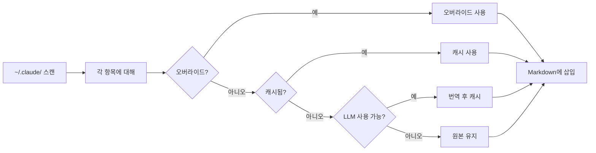
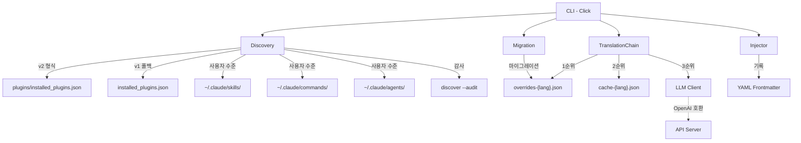

<div align="center">

# Claude Translator

**Claude Code용 다국어 플러그인 설명 번역기**

[](LICENSE) [](https://www.python.org/) [](https://github.com/debug-zhuweijian/claude-translator/releases) [](https://deepwiki.com/debug-zhuweijian/claude-translator) [![zread](https://img.shields.io/badge/Ask_Zread-_.svg?style=flat&color=00b0aa&labelColor=000000&logo=data%3Aimage%2Fsvg%2Bxml%3Bbase64%2CPHN2ZyB3aWR0aD0iMTYiIGhlaWdodD0iMTYiIHZpZXdCb3g9IjAgMCAxNiAxNiIgZmlsbD0ibm9uZSIgeG1sbnM9Imh0dHA6Ly93d3cudzMub3JnLzIwMDAvc3ZnIj4KPHBhdGggZD0iTTQuOTYxNTYgMS42MDAxSDIuMjQxNTZDMS44ODgxIDEuNjAwMSAxLjYwMTU2IDEuODg2NjQgMS42MDE1NiAyLjI0MDFWNC45NjAxQzEuNjAxNTYgNS4zMTM1NiAxLjg4ODEgNS42MDAxIDIuMjQxNTYgNS42MDAxSDQuOTYxNTZDNS4zMTUwMiA1LjYwMDEgNS42MDE1NiA1LjMxMzU2IDUuNjAxNTYgNC45NjAxVjIuMjQwMUM1LjYwMTU2IDEuODg2NjQgNS4zMTUwMiAxLjYwMDEgNC45NjE1NiAxLjYwMDFaIiBmaWxsPSIjZmZmIi8%2BCjxwYXRoIGQ9Ik00Ljk2MTU2IDEwLjM5OTlIMi4yNDE1NkMxLjg4ODEgMTAuMzk5OSAxLjYwMTU2IDEwLjY4NjQgMS42MDE1NiAxMS4wMzk5VjEzLjc1OTlDMS42MDE1NiAxNC4xMTM0IDEuODg4MSAxNC4zOTk5IDIuMjQxNTYgMTQuMzk5OUg0Ljk2MTU2QzUuMzE1MDIgMTQuMzk5OSA1LjYwMTU2IDE0LjExMzQgNS42MDE1NiAxMy43NTk5VjExLjAzOTlDNS42MDE1NiAxMC42ODY0IDUuMzE1MDIgMTAuMzk5OSA0Ljk2MTU2IDEwLjM5OTlaIiBmaWxsPSIjZmZmIi8%2BCjxwYXRoIGQ9Ik0xMy43NTg0IDEuNjAwMUgxMS4wMzg0QzEwLjY4NSAxLjYwMDEgMTAuMzk4NCAxLjg4NjY0IDEwLjM5ODQgMi4yNDAxVjQuOTYwMUMxMC4zOTg0IDUuMzEzNTYgMTAuNjg1IDUuNjAwMSAxMS4wMzg0IDUuNjAwMUgxMy43NTg0QzE0LjExMTkgNS42MDAxIDE0LjM5ODQgNS4zMTM1NiAxNC4zOTg0IDQuOTYwMVYyLjI0MDFDMTQuMzk4NCAxLjg4NjY0IDE0LjExMTkgMS42MDAxIDEzLjc1ODQgMS42MDAxWiIgZmlsbD0iI2ZmZiIvPgo8cGF0aCBkPSJNNCAxMkwxMiA0TDQgMTJaIiBmaWxsPSIjI2ZmZiIvPgo8cGF0aCBkPSJNNCAxMkwxMiA0IiBzdHJva2U9IiNmZmYiIHN0cm9rZS13aWR0aD0iMS41IiBzdHJva2UtbGluZWNhcD0icm91bmQiLz4KPC9zdmc%2BCg==&logoColor=ffffff)](https://zread.ai/debug-zhuweijian/claude-translator)

**[English](README.md)** | **[中文](README.zh-CN.md)** | **[日本語](README.ja.md)** | **[한국어](README.ko.md)**

</div>

---

Claude Code에는 수백 개의 커뮤니티 플러그인이 있습니다. 하지만 설명은 거의 모두 영어로 되어 있습니다. 팀에서 중국어, 일본어, 한국어를 사용한다면 매일 번역되지 않은 설명을 읽게 됩니다.

Claude Translator가 이 문제를 해결합니다: **스캔 -> 번역 -> 삽입**, 자동으로. 명령 하나로 모든 플러그인 설명이 원하는 언어로 번역됩니다.

## 목차

- [왜 Claude Translator인가?](#왜-claude-translator인가)
- [무엇을 하나요](#무엇을-하나요)
- [작동 방식](#작동-방식)
- [사전 요구 사항](#사전-요구-사항)
- [빠른 시작](#빠른-시작)
- [사용 가이드: 설치부터 전체 번역까지](#사용-가이드-설치부터-전체-번역까지)
- [설정](#설정)
- [스캔 대상](#스캔-대상)
- [기능](#기능)
- [CLI 참조](#cli-참조)
- [아키텍처](#아키텍처)
- [지원 언어](#지원-언어)
- [새로운 기능](#새로운-기능)
- [개발](#개발)
- [기여하기](#기여하기)
- [라이선스](#라이선스)

## 왜 Claude Translator인가?

**문제:** Claude Code에 50개 이상의 플러그인을 설치했습니다. 각 플러그인에는 영어로 된 `description` 필드가 있습니다. Claude Code가 어떤 플러그인을 사용할지 결정할 때 이 설명을 읽습니다. 설명이 모국어가 아닌 언어로 되어 있으면 컨텍스트를 잃게 됩니다. CJK 언어로 작업한다면 이는 일상적인 불편함입니다.

**해결책:** Claude Translator는 `~/.claude/` 디렉토리의 모든 플러그인, 스킬, 명령, 에이전트를 스캔하여 설명을 대상 언어로 번역하고 Markdown frontmatter에 직접 삽입합니다. 수동 편집 불필요. 관리할 파일 없음. `sync`만 실행하면 모든 것이 번역됩니다.

**하지 않는 것:** 스킬이나 에이전트의 전체 내용을 번역하지 않습니다. YAML frontmatter의 `description` 필드만 번역합니다. 이 필드는 Claude Code가 플러그인 선택 및 표시에 사용하는 필드입니다.

## 무엇을 하나요

번역 전:

```yaml
---
name: brainstorm
description: Brainstorm ideas collaboratively
---
# Brainstorm
```

번역 후:

```yaml
---
name: brainstorm
description: 협업 기반 브레인스토밍 아이디어 생성
---
# Brainstorm
```

원본 영어는 보존됩니다. 번역된 설명은 frontmatter에 직접 삽입되며, Claude Code는 다음 호출 시 즉시 이를 인식합니다.

## 작동 방식



발견된 각 항목에 대해 번역 체인은 4개의 소스를 순서대로 시도합니다:

1. **사용자 오버라이드** -- `overrides-{lang}.json`에 저장된 수동 번역 (최우선 순위)
2. **캐시** -- 이전에 LLM이 번역한 결과, `cache-{lang}.json`에 저장
3. **LLM** -- 설정된 모델을 호출하여 번역한 후 캐시에 저장
4. **원본** -- LLM을 사용할 수 없는 경우 영어 텍스트 유지

## 사전 요구 사항

| 종속성 | 버전 | 설치 | 확인 |
|--------|------|------|------|
| Python | 3.10+ | [python.org](https://www.python.org/) 또는 `winget install Python.Python.3.12` | `python --version` |
| pip | 최신 | Python에 포함 | `pip --version` |
| LLM API 키 | 임의 | OpenAI, Ollama, vLLM 또는 OpenAI 호환 엔드포인트 | -- |

> **OpenAI 키가 없나요?** Claude Translator는 Ollama나 vLLM을 통한 로컬 모델도 지원합니다. 아래의 [로컬 모델 사용](#로컬-모델-사용)을 참조하세요.

## 빠른 시작

### 1. 설치

```bash
git clone https://github.com/debug-zhuweijian/claude-translator.git
cd claude-translator
pip install .
```

확인:

```
$ claude-translator --version
claude-translator, version 0.5.0
```

### 2. 초기화

대상 언어를 설정합니다. `~/.claude/translations/config.json`이 생성됩니다:

```bash
$ claude-translator init --lang zh-CN
Created config at C:\Users\you\.claude\translations\config.json (target: zh-CN)
```

### 3. 탐색

번역 가능한 항목을 확인합니다. 사용자 수준 스킬, 명령, 에이전트와 설치된 플러그인을 스캔합니다:

```
$ claude-translator discover
Scanning C:\Users\you\.claude ...
Found <count> translatable items (target: zh-CN)
  ok [user] user.skill:academic-writing
  ok [user] user.skill:brainstorming
  ok [user] user.command:commit
  ok [plugin] plugin.superpowers.skill:brainstorm
  ok [plugin] plugin.superpowers.skill:tdd-guide
  ok [plugin] plugin.compound-engineering.skill:code-review
  ok [plugin] plugin.everything-claude-code.agent:build-error-resolver
  ok [plugin] plugin.everything-claude-code.skill:e2e
  ...
```

각 줄은 상태 (`ok` = frontmatter 있음, `no` = 누락), 범위 (`[user]` 또는 `[plugin]`), 정규화된 ID를 보여줍니다.

### 4. 번역

번역을 실행합니다. 항목당 4단계 폴백을 사용합니다:

```
$ claude-translator sync
Scanning C:\Users\you\.claude ...
Translating <count> items to zh-CN ...
  [override] plugin.codex.agent:codex-rescue
  [cache] plugin.superpowers.skill:brainstorm
  [llm] plugin.compound-engineering.skill:code-review
  [llm] plugin.everything-claude-code.agent:build-error-resolver
  [skip] user.skill:my-custom-skill
  ...
Sync complete.
```

레이블 설명:
- `[override]` -- 수동 `overrides-zh-CN.json`에서 가져옴
- `[cache]` -- 이전에 LLM이 번역하여 `cache-zh-CN.json`에 저장된 항목
- `[llm]` -- LLM이 새로 번역한 후 캐시에 저장
- `[skip]` -- 변경 불필요 (이미 번역됨 또는 비어 있음)

### 5. 확인

sync 후 커버리지를 확인합니다:

```
$ claude-translator verify
  MISSING: plugin.new-tool.skill:deploy
Coverage: <covered>/<count> (99.8%) -- 1 missing
```

---

## 사용 가이드: 설치부터 전체 번역까지

### 시나리오: Windows에 50개 플러그인과 함께 Claude Code를 설치한 경우

Claude Code를 설치하고 연구, 작성, 개발용 플러그인을 추가했습니다. 모든 것이 작동하지만 플러그인 설명이 모두 영어입니다. 더 빠르게 읽기 위해 한국어로 번역하고 싶습니다.

#### 1단계: 설치 및 초기화

```
C:\Users\you> git clone https://github.com/debug-zhuweijian/claude-translator.git
C:\Users\you> cd claude-translator
C:\Users\you\claude-translator> pip install .

C:\Users\you\claude-translator> claude-translator init --lang ko
Created config at C:\Users\you\.claude\translations\config.json (target: ko)
```

설정 파일은 claude-translator에 대상 언어를 알려줍니다. `init`은 한 번만 실행하면 됩니다.

#### 2단계: 보유 항목 확인

```
C:\Users\you\claude-translator> claude-translator discover
Scanning C:\Users\you\.claude ...
Found <count> translatable items (target: ko)
  ok [user] user.skill:academic-writing
  ok [user] user.command:commit
  ok [plugin] plugin.superpowers.skill:brainstorm
  ok [plugin] plugin.superpowers.skill:tdd-guide
  ...
```

항목 수는 로컬 Claude Code 설정에 따라 달라지며 사용자 스킬, 명령, 에이전트와 설치된 플러그인 엔트리포인트를 포함합니다. `ok` 상태는 항목에 번역 준비가 된 `description` 필드가 있는 frontmatter가 있음을 의미합니다.

#### 3단계: LLM 설정

OpenAI API 키가 있는 경우 `OPENAI_API_KEY`에서 자동으로 인식됩니다. 로컬 모델을 사용하는 경우:

```
C:\Users\you\claude-translator> set CLAUDE_TRANSLATE_LLM_BASE_URL=http://localhost:11434/v1
C:\Users\you\claude-translator> set CLAUDE_TRANSLATE_LLM_API_KEY=ollama
C:\Users\you\claude-translator> set CLAUDE_TRANSLATE_LLM_MODEL=qwen2.5:7b
```

#### 4단계: 번역 실행

```
C:\Users\you\claude-translator> claude-translator sync
Scanning C:\Users\you\.claude ...
Translating <count> items to ko ...
  [llm] plugin.superpowers.skill:brainstorm
  [llm] plugin.superpowers.skill:tdd-guide
  [llm] plugin.compound-engineering.skill:code-review
  [llm] plugin.everything-claude-code.agent:build-error-resolver
  [llm] plugin.everything-claude-code.skill:e2e
  ...
Sync complete.
```

각 항목은 LLM을 통해 번역되고 캐시됩니다. 다음 실행 시 캐시된 항목은 재사용되며, 새로운 항목이나 변경된 항목만 LLM을 호출합니다.

#### 5단계: 잘못된 번역 수정

LLM이 "brainstorm"을 "브레인스토밍"으로 번역했지만 "협업 기반 브레인스토밍 아이디어 생성"을 선호하는 경우, 오버라이드 파일을 편집합니다:

`C:\Users\you\.claude\translations\overrides-ko.json`:

```json
{
  "plugin.superpowers.skill:brainstorm": "협업 기반 브레인스토밍 아이디어 생성"
}
```

`sync`를 다시 실행합니다:

```
C:\Users\you\claude-translator> claude-translator sync
  [override] plugin.superpowers.skill:brainstorm
  ...
```

오버라이드가 최우선 순위를 갖습니다. 향후 sync에서 덮어씌워지지 않습니다.

#### 6단계: 모든 항목 번역 확인

```
C:\Users\you\claude-translator> claude-translator verify
Coverage: <count>/<count> (100.0%) -- 0 missing
```

모든 플러그인 설명이 한국어로 번역되었습니다. Claude Code는 번역된 설명을 즉시 사용합니다.

### 빠른 참조 표

| 작업 | 명령 |
|------|------|
| 처음 설정 | `claude-translator init --lang ko` |
| 번역 가능한 항목 보기 | `claude-translator discover` |
| 전체 번역 | `claude-translator sync` |
| 누락 항목 확인 | `claude-translator verify` |
| 특정 번역 수정 | `overrides-ko.json` 편집 후 `sync` |
| 대상 언어 변경 | `claude-translator sync --lang ja` |

---

## 설정

### 설정 우선순위

```
CLI 인수  >  환경 변수  >  config.json  >  기본값
```

### 환경 변수

| 변수 | 용도 | 대체값 |
|------|------|--------|
| `CLAUDE_TRANSLATE_LANG` | 대상 언어 | config 또는 `zh-CN` |
| `CLAUDE_TRANSLATE_LLM_BASE_URL` | API 엔드포인트 | `OPENAI_BASE_URL` |
| `CLAUDE_TRANSLATE_LLM_API_KEY` | API 키 | `OPENAI_API_KEY` |
| `CLAUDE_TRANSLATE_LLM_MODEL` | 모델 이름 | `OPENAI_MODEL` 또는 `gpt-4o-mini` |

### 데이터 파일

모두 `~/.claude/translations/`에 저장됩니다:

| 파일 | 용도 |
|------|------|
| `config.json` | 설정 (`init`으로 생성) |
| `overrides-ko.json` | 수동 번역 (최우선 순위) |
| `cache-ko.json` | LLM 번역 캐시 |

### 로컬 모델 사용

OpenAI 키가 없나요? 로컬 모델을 사용하세요:

```bash
# Ollama
export CLAUDE_TRANSLATE_LLM_BASE_URL="http://localhost:11434/v1"
export CLAUDE_TRANSLATE_LLM_API_KEY="ollama"
export CLAUDE_TRANSLATE_LLM_MODEL="qwen2.5:7b"

# vLLM
export CLAUDE_TRANSLATE_LLM_BASE_URL="http://localhost:8000/v1"
export CLAUDE_TRANSLATE_LLM_MODEL="Qwen/Qwen2.5-7B-Instruct"
```

### 수동 오버라이드

`~/.claude/translations/overrides-ko.json`을 편집하여 번역을 수정합니다:

```json
{
  "plugin.superpowers.skill:brainstorm": "협업 기반 브레인스토밍 아이디어 생성"
}
```

오버라이드는 항상 최우선이며, `sync`로 덮어씌워지지 않습니다.

## 스캔 대상

| 소스 | 경로 | 예시 |
|------|------|------|
| 사용자 스킬 | `~/.claude/skills/*.md` 및 `~/.claude/skills/**/SKILL.md` | `my-skill.md`, `team/tool/SKILL.md` |
| 사용자 명령 | `~/.claude/commands/**/*.md` | `commit.md`, `gsd/add-backlog.md` |
| 사용자 에이전트 | `~/.claude/agents/**/*.md` | `code-reviewer.md`, `review/security.md` |
| 플러그인 스킬 | `<plugin>/skills/*.md` 및 `<plugin>/skills/**/SKILL.md` | 플러그인별 스킬 엔트리포인트 |
| 플러그인 명령 | `<plugin>/commands/**/*.md` | 플러그인별 슬래시 명령 |
| 플러그인 에이전트 | `<plugin>/agents/**/*.md` | 플러그인별 에이전트 정의 |

스킬 번들 내부의 지원 문서는 엔트리포인트 `SKILL.md`가 아닌 한 무시됩니다. 플러그인 레지스트리는 `~/.claude/plugins/installed_plugins.json` (v2 형식)에서 읽으며, `~/.claude/installed_plugins.json` (v1 형식)으로 폴백합니다. 여러 버전의 플러그인은 중복 제거되며, 최신 버전만 번역됩니다.

## 기능

| 기능 | 설명 |
|------|------|
| **자동 탐색** | `~/.claude/`의 모든 플러그인, 스킬, 명령, 에이전트 스캔 |
| **4단계 폴백** | 사용자 오버라이드 -> 캐시된 번역 -> LLM 번역 -> 원본 텍스트 |
| **수동 오버라이드** | `overrides-{lang}.json`을 통한 세밀한 번역 조정 |
| **다중 버전 중복 제거** | 동일한 플러그인의 여러 버전이 있는 경우 최신 버전만 번역 |
| **CJK 지원** | 중국어, 일본어, 한국어 스크립트 내장 감지 |
| **OpenAI 호환** | OpenAI, Ollama, vLLM 또는 호환 가능한 API에서 작동 |
| **CRLF 안전** | Windows에서 줄바꿈 보존, 파일 손상 없음 |
| **BOM 안전** | Windows 편집기가 추가한 UTF-8 BOM 마커 보존 |
| **레거시 마이그레이션** | 첫 실행 시 이전 형식의 번역 데이터를 자동 마이그레이션 |
| **설정 우선순위** | CLI 인수 -> 환경 변수 -> 설정 파일 -> 기본값 |
| **Dry Run** | `sync --dry-run` 으로 파일을 쓰지 않고 변경 사항 미리 보기 |

## CLI 참조

| 명령 | 설명 |
|------|------|
| `init --lang LANG` | 대상 언어로 설정 생성 |
| `discover [--lang LANG] [--audit]` | 번역 가능한 항목과 선택적 스캔 감사 요약 나열 |
| `sync [--lang LANG] [--dry-run]` | 설명 번역 후 파일에 기록 |
| `verify [--lang LANG]` | 커버리지 확인, 누락된 항목 보고 |

## 아키텍처



## 지원 언어

LLM이 지원하는 모든 언어. 다음 언어 쌍에 대한 내장 프롬프트 제공:

영어 -> 중국어 (간체/번체) / 일본어 / 한국어, 중국어 -> 일본어 / 한국어

## 새로운 기능

### v0.2.0

- **안전한 YAML frontmatter round-trip** -- `ruamel.yaml` 로 따옴표, 콜론, 여러 줄 description 을 안전하게 유지하며 갱신
- **번역 파이프라인 강화** -- 주입 전에 LLM 응답을 정리하고 OpenAI 클라이언트에 timeout/retry 를 추가했으며 `sync` 가 실패 항목을 집계
- **파일 작업 안정성 향상** -- cache / overrides 는 atomic write 를 사용하고 translations 디렉터리는 실제 쓰기 시점에만 생성
- **CLI 사용성 개선** -- `sync --dry-run` 추가, `verify` 는 zh/ja/ko 대상에서 실제 frontmatter 내용을 검사

### v0.1.1

- **여러 줄 frontmatter 파싱** -- 들여쓰기된 연속 줄이 자동으로 누락되지 않고 올바르게 캡처됨
- **따옴표 제거** -- `"따옴표로 묶인"` 및 `'따옴표로 묶인'` frontmatter 값이 올바르게 따옴표 해제됨
- **UTF-8 BOM 보존** -- BOM 접두사가 있는 파일이 삽입 후에도 BOM을 잃지 않음
- **플러그인 탐색 수정** -- 레지스트리 경로 (`~/.claude/plugins/`) 및 v2 형식 파싱 수정

### v0.1.0

4개의 CLI 명령, 자동 탐색, 4단계 폴백, CJK 지원 및 OpenAI 호환 클라이언트가 포함된 초기 릴리스. 자세한 내용은 [CHANGELOG.md](CHANGELOG.md)를 참조하세요.

## 개발

```bash
pip install -e ".[dev]"
python -m pytest -q
ruff check src/ tests/
```

CLI 는 `python -m claude_translator` 로도 실행할 수 있습니다.

## 기여하기

기여를 환영합니다.

**버그 보고:**
1. `bug` 레이블로 이슈를 열어주세요
2. 발생한 현상, 예상 동작, 환경(OS, Python 버전)을 설명해주세요

**기능 제안:**
1. `enhancement` 레이블로 이슈를 열어주세요
2. 사용 사례와 기존 기능으로 해결할 수 없는 이유를 설명해주세요

**수정 제출:**
1. 저장소를 포크해주세요
2. 브랜치를 생성해주세요: `git checkout -b fix/your-fix`
3. 변경 사항에 대한 명확한 설명과 함께 PR을 제출해주세요

## 라이선스

[MIT](LICENSE) -- Copyright (c) 2025 debug-zhuweijian
