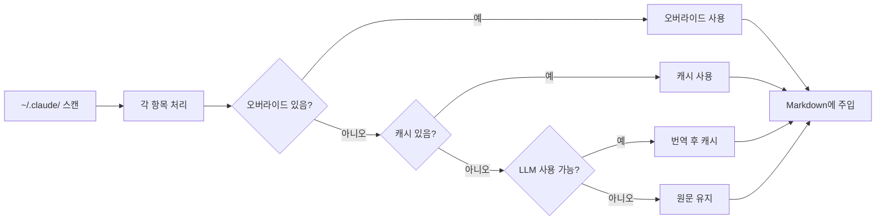
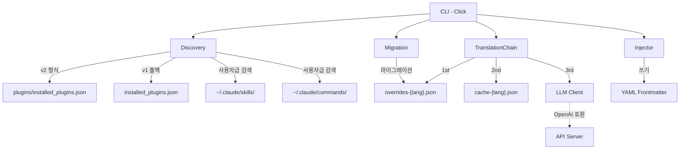

<div align="center">

# Claude Translator

**Claude Code 플러그인 설명 다국어 번역 도구**

[](LICENSE) [](CHANGELOG.md) [](https://www.python.org/)

[English](README.md) | [中文](README.zh-CN.md) | [日本語](README.ja.md) | [한국어](README.ko.md)

</div>

## 왜 Claude Translator가 필요한가요?

Claude Code에는 수백 개의 커뮤니티 플러그인이 있지만, 설명은 거의 다 영어입니다. 한국어, 중국어, 일본어로 작업한다면 매일 번역되지 않은 설명을 읽게 됩니다.

Claude Translator가 해결합니다: **스캔 → 번역 → 주입**, 자동으로. 명령 하나로 모든 플러그인 설명이 여러분의 언어로 바뀝니다.

## 어떻게 바뀌나요

번역 전:

```yaml
---
name: brainstorm
description: Brainstorm ideas collaboratively
---
# Brainstorm
```

번역 후:

```yaml
---
name: brainstorm
description: 협업 브레인스토밍으로 아이디어 생성
---
# Brainstorm
```

원본 영어는 그대로 유지되고, 번역된 설명이 frontmatter에 직접 주입됩니다. Claude Code가 즉시 반영합니다.

## 작동 방식



## 빠른 시작

### 1. 설치

```bash
git clone https://github.com/debug-zhuweijian/claude-translator.git
cd claude-translator
pip install .
```

확인:

```
$ claude-translator --version
claude-translator, version 0.1.0
```

### 2. 초기화

대상 언어를 설정합니다. `~/.claude/translations/config.json`이 생성됩니다:

```bash
$ claude-translator init --lang ko
Created config at C:\Users\you\.claude\translations\config.json (target: ko)
```

### 3. 검색

번역 가능한 항목을 확인합니다. 사용자 수준 스킬/명령어와 설치된 플러그인을 **모두** 스캔합니다:

```
$ claude-translator discover
Scanning C:\Users\you\.claude ...
Found 440 translatable items (target: ko)
  ok [user] user.skill:academic-writing
  ok [user] user.skill:brainstorming
  ok [user] user.command:commit
  ok [plugin] plugin.superpowers.skill:brainstorm
  ok [plugin] plugin.superpowers.skill:tdd-guide
  ok [plugin] plugin.compound-engineering.skill:code-review
  ok [plugin] plugin.everything-claude-code.agent:build-error-resolver
  ok [plugin] plugin.everything-claude-code.skill:e2e
  ...
```

각 줄: 상태(`ok` = frontmatter 있음, `no` = 없음), 범위(`[user]` 또는 `[plugin]`), 정규 ID.

### 4. 번역 실행

번역을 실행합니다. 각 항목에 4단계 폴백을 사용합니다:

```
$ claude-translator sync
Scanning C:\Users\you\.claude ...
Translating 440 items to ko ...
  [override] plugin.codex.agent:codex-rescue
  [cache] plugin.superpowers.skill:brainstorm
  [llm] plugin.compound-engineering.skill:code-review
  [llm] plugin.everything-claude-code.agent:build-error-resolver
  [skip] user.skill:my-custom-skill
  ...
Sync complete.
```

상태 라벨:
- `[override]` — 수동 `overrides-ko.json`에서
- `[cache]` — 이전에 LLM으로 번역됨, `cache-ko.json`에 저장
- `[llm]` — 이번에 LLM으로 새로 번역, 자동 캐시
- `[skip]` — 변경 불필요 (이미 번역됨 또는 비어 있음)

### 5. 검증

동기화 후 커버리지 확인:

```
$ claude-translator verify
  MISSING: plugin.new-tool.skill:deploy
Coverage: 439/440 (99.8%) — 1 missing
```

## 설정

### 우선순위 캐스케이드

```
CLI 인자  >  환경 변수  >  config.json  >  기본값
```

### 환경 변수

| 변수 | 용도 | 대체값 |
|------|------|--------|
| `CLAUDE_TRANSLATE_LANG` | 대상 언어 | 설정 파일 또는 `zh-CN` |
| `CLAUDE_TRANSLATE_LLM_BASE_URL` | API 엔드포인트 | `OPENAI_BASE_URL` |
| `CLAUDE_TRANSLATE_LLM_API_KEY` | API 키 | `OPENAI_API_KEY` |
| `CLAUDE_TRANSLATE_LLM_MODEL` | 모델 이름 | `OPENAI_MODEL` 또는 `gpt-4o-mini` |

### 데이터 파일

`~/.claude/translations/`에 저장：

| 파일 | 용도 |
|------|------|
| `config.json` | 설정 파일 (`init`으로 생성) |
| `overrides-ko.json` | 수동 번역 오버라이드 (최고 우선순위) |
| `cache-ko.json` | LLM 번역 자동 캐시 |

### 로컬 모델 사용

OpenAI 키 없이 로컬 모델로 사용 가능:

```bash
# Ollama
export CLAUDE_TRANSLATE_LLM_BASE_URL="http://localhost:11434/v1"
export CLAUDE_TRANSLATE_LLM_API_KEY="ollama"
export CLAUDE_TRANSLATE_LLM_MODEL="qwen2.5:7b"

# vLLM
export CLAUDE_TRANSLATE_LLM_BASE_URL="http://localhost:8000/v1"
export CLAUDE_TRANSLATE_LLM_MODEL="Qwen/Qwen2.5-7B-Instruct"
```

### 수동 오버라이드

`~/.claude/translations/overrides-ko.json`을 편집하여 번역 수정:

```json
{
  "plugin.superpowers.skill:brainstorm": "협업 브레인스토밍으로 아이디어 생성"
}
```

오버라이드는 항상 최우선 — `sync`로 덮어쓰이지 않습니다.

## 스캔 범위

| 소스 | 경로 | 예시 |
|------|------|------|
| 사용자 스킬 | `~/.claude/skills/**/*.md` | `SKILL.md`, `my-skill.md` |
| 사용자 명령어 | `~/.claude/commands/**/*.md` | `commit.md`, `review.md` |
| 플러그인 스킬 | `<plugin>/skills/**/*.md` | 플러그인별 스킬 정의 |
| 플러그인 명령어 | `<plugin>/commands/**/*.md` | 플러그인별 슬래시 명령어 |
| 플러그인 에이전트 | `<plugin>/agents/**/*.md` | 플러그인별 Agent 정의 |

플러그인 레지스트리는 `~/.claude/plugins/installed_plugins.json`(v2 형식)에서 읽고, `~/.claude/installed_plugins.json`(v1 형식)으로 폴백합니다. 다중 버전 플러그인은 자동 중복 제거 — 최신 버전만 번역됩니다.

## 주요 기능

| 기능 | 설명 |
|------|------|
| **자동 검색** | `~/.claude/` 내의 모든 플러그인, 스킬, 명령어, 에이전트를 스캔 |
| **4단계 폴백** | 사용자 오버라이드 → 캐시 → LLM 번역 → 원문 |
| **수동 오버라이드** | `overrides-{lang}.json`으로 개별 미세 조정 |
| **멀티버전 중복 제거** | 동일 플러그인 여러 버전은 최신만 번역 |
| **CJK 지원** | 중국어, 일본어, 한국어 스크립트 감지 내장 |
| **OpenAI 호환** | OpenAI, Ollama, vLLM 등에서 작동 |
| **CRLF 안전** | Windows에서 줄바꿈 문자 보존, 파일 손상 없음 |
| **레거시 마이그레이션** | 첫 실행 시 이전 형식 자동 마이그레이션 |
| **설정 캐스케이드** | CLI 인자 → 환경 변수 → 설정 파일 → 기본값 |

## CLI 명령어

| 명령어 | 설명 |
|--------|------|
| `init --lang LANG` | 대상 언어를 지정하여 설정 생성 |
| `discover [--lang LANG]` | 번역 가능한 항목과 상태 나열 |
| `sync [--lang LANG]` | 번역 실행 후 파일에 쓰기 |
| `verify [--lang LANG]` | 커버리지 확인, 누락 항목 보고 |

## 아키텍처



## 지원 언어

LLM이 지원하는 모든 언어를 사용할 수 있습니다. 내장 프롬프트 템플릿：

영어 → 중국어 (간체/번체) / 일본어 / 한국어, 중국어 → 일본어 / 한국어

## 개발

```bash
pip install -e ".[dev]"
python -m pytest tests/ -v
ruff check src/ tests/
```

## 라이선스

[MIT](LICENSE)
