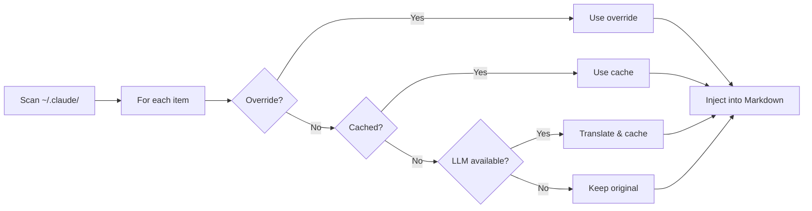
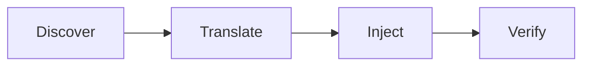

<div align="center">

# Claude Translator

**Multi-language plugin description translator for Claude Code**

[](LICENSE) [](CHANGELOG.md) [](https://www.python.org/) []()

[English](README.md) | [中文](README.zh-CN.md) | [日本語](README.ja.md) | [한국어](README.ko.md)

</div>

## Why Claude Translator?

Claude Code has hundreds of community plugins — but their descriptions are almost all in English. If your team works in Chinese, Japanese, or Korean, you're reading untranslated descriptions every day.

Claude Translator fixes this: **scan → translate → inject**, automatically. One command, all your plugin descriptions are in your language.

## What It Does

Takes a Markdown file like this:

```yaml
---
name: brainstorm
description: Brainstorm ideas collaboratively
---
# Brainstorm
```

And turns it into this:

```yaml
---
name: brainstorm
description: 协作式头脑风暴创意生成
---
# Brainstorm
```

The original English is preserved. The translated description is injected directly into the frontmatter — Claude Code picks it up instantly.

## How It Works





## Quick Start

### Install

```bash
git clone https://github.com/debug-zhuweijian/claude-translator.git
cd claude-translator
pip install .
```

### Initialize

```bash
$ claude-translator init --lang zh-CN
Created config at ~/.claude/translations/config.json (target: zh-CN)
```

### Discover

```bash
$ claude-translator discover
Scanning /home/user/.claude ...
Found 47 translatable items (target: zh-CN)
  ok [plugin] plugin.codex.agent:codex-rescue
  ok [plugin] plugin.superpowers.skill:brainstorm
  no [user] user.skill:my-custom-skill
  ...
```

### Translate

```bash
$ claude-translator sync
Scanning /home/user/.claude ...
Translating 47 items to zh-CN ...
  [override] plugin.codex.agent:codex-rescue
  [cache] plugin.superpowers.skill:brainstorm
  [llm] plugin.ecc-skills.command:commit
  [skip] user.skill:my-custom-skill
Sync complete.
```

### Verify

```bash
$ claude-translator verify
  MISSING: plugin.new-tool.skill:deploy
Coverage: 46/47 (97.9%) — 1 missing
```

## Features

| Feature | Description |
|---------|-------------|
| **Auto Discovery** | Scans all plugins, skills, commands, and agents from `~/.claude/` |
| **4-Level Fallback** | User override → cached translation → LLM translation → original text |
| **Manual Overrides** | Fine-tune any translation via `overrides-{lang}.json` |
| **Multi-Version Dedup** | Same plugin at different versions? Only the latest is translated |
| **CJK Support** | Built-in detection for Chinese, Japanese, and Korean scripts |
| **OpenAI-Compatible** | Works with OpenAI, Ollama, vLLM, or any compatible API |
| **CRLF Safe** | Preserves line endings on Windows — no file corruption |
| **Legacy Migration** | Auto-migrates old-format translation data on first run |
| **Config Cascade** | CLI args → env vars → config file → defaults |

## CLI Reference

| Command | Description |
|---------|-------------|
| `init --lang LANG` | Create config with target language |
| `discover [--lang LANG]` | List translatable items and status |
| `sync [--lang LANG]` | Translate descriptions and write to files |
| `verify [--lang LANG]` | Check coverage, report missing items |

## Configuration

### Config Cascade

```
CLI args  >  Environment variables  >  config.json  >  Defaults
```

### Environment Variables

| Variable | Purpose | Fallback |
|----------|---------|----------|
| `CLAUDE_TRANSLATE_LANG` | Target language | config or `zh-CN` |
| `CLAUDE_TRANSLATE_LLM_BASE_URL` | API endpoint | `OPENAI_BASE_URL` |
| `CLAUDE_TRANSLATE_LLM_API_KEY` | API key | `OPENAI_API_KEY` |
| `CLAUDE_TRANSLATE_LLM_MODEL` | Model name | `OPENAI_MODEL` or `gpt-4o-mini` |

### Data Files

All stored in `~/.claude/translations/`:

| File | Purpose |
|------|---------|
| `config.json` | Configuration (created by `init`) |
| `overrides-zh-CN.json` | Your manual translations (highest priority) |
| `cache-zh-CN.json` | LLM translations cache |

### Using Local Models

```bash
# Ollama
export CLAUDE_TRANSLATE_LLM_BASE_URL="http://localhost:11434/v1"
export CLAUDE_TRANSLATE_LLM_API_KEY="ollama"
export CLAUDE_TRANSLATE_LLM_MODEL="qwen2.5:7b"

# vLLM
export CLAUDE_TRANSLATE_LLM_BASE_URL="http://localhost:8000/v1"
export CLAUDE_TRANSLATE_LLM_MODEL="Qwen/Qwen2.5-7B-Instruct"
```

## Architecture

```mermaid
graph TB
    CLI[CLI - Click] --> DISC[Discovery]
    CLI --> TRANS[TranslationChain]
    CLI --> INJ[Injector]
    CLI --> MIGR[Migration]

    DISC --> |scan plugins| PLUGIN[installed_plugins.json]
    DISC --> |scan user-level| USER[~/.claude/skills/]
    DISC --> |scan user-level| USERC[~/.claude/commands/]

    TRANS --> |1st| OV[overrides-{lang}.json]
    TRANS --> |2nd| CACHE[cache-{lang}.json]
    TRANS --> |3rd| LLM[LLM Client]

    INJ --> |write| FM[YAML Frontmatter]
    MIGR --> |migrate| OV

    LLM -.-> |OpenAI compat| API[API Server]
```

## Supported Languages

Any language your LLM supports. Built-in prompts for:

English → Chinese / Japanese / Korean, Chinese → Japanese / Korean

## Development

```bash
pip install -e ".[dev]"
python -m pytest tests/ -v
ruff check src/ tests/
```

## License

[MIT](LICENSE)
