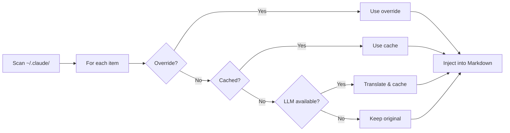
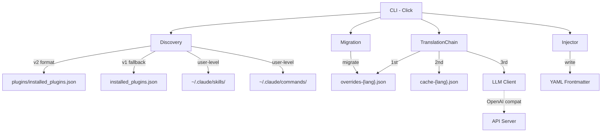

<div align="center">

# Claude Translator

**Multi-language plugin description translator for Claude Code**

[](LICENSE) [](CHANGELOG.md) [](https://www.python.org/) [](https://github.com/debug-zhuweijian/claude-translator/releases)

**[English](README.md)** | **[中文](README.zh-CN.md)** | **[日本語](README.ja.md)** | **[한국어](README.ko.md)**

</div>

---

Claude Code has hundreds of community plugins -- but their descriptions are almost all in English. If your team works in Chinese, Japanese, or Korean, you're reading untranslated descriptions every day.

Claude Translator fixes this: **scan -> translate -> inject**, automatically. One command, all your plugin descriptions are in your language.

## Table of Contents

- [Why Claude Translator?](#why-claude-translator)
- [What It Does](#what-it-does)
- [How It Works](#how-it-works)
- [Prerequisites](#prerequisites)
- [Quick Start](#quick-start)
- [Usage Walkthrough: From Install to Full Translation](#usage-walkthrough-from-install-to-full-translation)
- [Configuration](#configuration)
- [What Gets Scanned](#what-gets-scanned)
- [Features](#features)
- [CLI Reference](#cli-reference)
- [Architecture](#architecture)
- [Supported Languages](#supported-languages)
- [What's New](#whats-new)
- [Development](#development)
- [Contributing](#contributing)
- [License](#license)

## Why Claude Translator?

**The problem:** You install 50+ Claude Code plugins. Each has a `description` field in English. When Claude Code picks which plugin to use, it reads that description. If the description is in a language you don't read natively, you lose context. If you work in CJK languages, this is a daily friction.

**The solution:** Claude Translator scans every plugin, skill, command, and agent in your `~/.claude/` directory, translates the description into your target language, and injects it directly into the Markdown frontmatter. No manual editing. No files to manage. Just run `sync` and everything is translated.

**What it does NOT do:** It does not translate the full content of skills or agents -- only the `description` field in YAML frontmatter. This is the field Claude Code uses for plugin selection and display.

## What It Does

Before:

```yaml
---
name: brainstorm
description: Brainstorm ideas collaboratively
---
# Brainstorm
```

After:

```yaml
---
name: brainstorm
description: 协作式头脑风暴创意生成
---
# Brainstorm
```

The original English is preserved. The translated description is injected directly into the frontmatter -- Claude Code picks it up instantly on next invocation.

## How It Works



For each discovered item, the translation chain tries four sources in order:

1. **User override** -- your manual translations in `overrides-{lang}.json` (highest priority)
2. **Cache** -- previously LLM-translated, stored in `cache-{lang}.json`
3. **LLM** -- call the configured model to translate, then cache the result
4. **Original** -- if no LLM is available, keep the English text

## Prerequisites

| Dependency | Version | Install | Verify |
|------------|---------|---------|--------|
| Python | 3.10+ | [python.org](https://www.python.org/) or `winget install Python.Python.3.12` | `python --version` |
| pip | Latest | Included with Python | `pip --version` |
| LLM API key | Any | OpenAI, Ollama, vLLM, or any OpenAI-compatible endpoint | -- |

> **No OpenAI key?** Claude Translator works with local models via Ollama or vLLM. See [Using Local Models](#using-local-models) below.

## Quick Start

### 1. Install

```bash
git clone https://github.com/debug-zhuweijian/claude-translator.git
cd claude-translator
pip install .
```

Verify:

```
$ claude-translator --version
claude-translator, version 0.2.0
```

### 2. Initialize

Set your target language. This creates `~/.claude/translations/config.json`:

```bash
$ claude-translator init --lang zh-CN
Created config at C:\Users\you\.claude\translations\config.json (target: zh-CN)
```

### 3. Discover

See what can be translated. This scans **both** user-level skills/commands and installed plugins:

```
$ claude-translator discover
Scanning C:\Users\you\.claude ...
Found 440 translatable items (target: zh-CN)
  ok [user] user.skill:academic-writing
  ok [user] user.skill:brainstorming
  ok [user] user.command:commit
  ok [plugin] plugin.superpowers.skill:brainstorm
  ok [plugin] plugin.superpowers.skill:tdd-guide
  ok [plugin] plugin.compound-engineering.skill:code-review
  ok [plugin] plugin.everything-claude-code.agent:build-error-resolver
  ok [plugin] plugin.everything-claude-code.skill:e2e
  ...
```

Each line shows: status (`ok` = has frontmatter, `no` = missing), scope (`[user]` or `[plugin]`), and canonical ID.

### 4. Translate

Run the translation. It uses a 4-level fallback per item:

```
$ claude-translator sync
Scanning C:\Users\you\.claude ...
Translating 440 items to zh-CN ...
  [override] plugin.codex.agent:codex-rescue
  [cache] plugin.superpowers.skill:brainstorm
  [llm] plugin.compound-engineering.skill:code-review
  [llm] plugin.everything-claude-code.agent:build-error-resolver
  [skip] user.skill:my-custom-skill
  ...
Sync complete.
```

Labels:
- `[override]` -- from your manual `overrides-zh-CN.json`
- `[cache]` -- previously translated by LLM, saved in `cache-zh-CN.json`
- `[llm]` -- freshly translated by the LLM, then cached
- `[skip]` -- no change needed (already translated or empty)

### 5. Verify

Check coverage after sync:

```
$ claude-translator verify
  MISSING: plugin.new-tool.skill:deploy
Coverage: 439/440 (99.8%) -- 1 missing
```

---

## Usage Walkthrough: From Install to Full Translation

### Scenario: You just set up Claude Code with 50 plugins on Windows

You installed Claude Code, added plugins for research, writing, and development. Everything works, but all plugin descriptions are in English. You want them in Chinese so you can read them faster.

#### Step 1: Install and Initialize

```
C:\Users\you> git clone https://github.com/debug-zhuweijian/claude-translator.git
C:\Users\you> cd claude-translator
C:\Users\you\claude-translator> pip install .

C:\Users\you\claude-translator> claude-translator init --lang zh-CN
Created config at C:\Users\you\.claude\translations\config.json (target: zh-CN)
```

The config file tells claude-translator your target language. You only run `init` once.

#### Step 2: See What You Have

```
C:\Users\you\claude-translator> claude-translator discover
Scanning C:\Users\you\.claude ...
Found 440 translatable items (target: zh-CN)
  ok [user] user.skill:academic-writing
  ok [user] user.command:commit
  ok [plugin] plugin.superpowers.skill:brainstorm
  ok [plugin] plugin.superpowers.skill:tdd-guide
  ...
```

440 items across user skills, user commands, and installed plugins. The `ok` status means the item has a frontmatter with a `description` field ready for translation.

#### Step 3: Configure Your LLM

If you have an OpenAI API key, it's picked up automatically from `OPENAI_API_KEY`. If you use a local model:

```
C:\Users\you\claude-translator> set CLAUDE_TRANSLATE_LLM_BASE_URL=http://localhost:11434/v1
C:\Users\you\claude-translator> set CLAUDE_TRANSLATE_LLM_API_KEY=ollama
C:\Users\you\claude-translator> set CLAUDE_TRANSLATE_LLM_MODEL=qwen2.5:7b
```

#### Step 4: Run the Translation

```
C:\Users\you\claude-translator> claude-translator sync
Scanning C:\Users\you\.claude ...
Translating 440 items to zh-CN ...
  [llm] plugin.superpowers.skill:brainstorm
  [llm] plugin.superpowers.skill:tdd-guide
  [llm] plugin.compound-engineering.skill:code-review
  [llm] plugin.everything-claude-code.agent:build-error-resolver
  [llm] plugin.everything-claude-code.skill:e2e
  ...
Sync complete.
```

Each item is translated via LLM and cached. On next run, cached items are reused -- only new or changed items hit the LLM.

#### Step 5: Fix a Bad Translation

The LLM translated "brainstorm" as "头脑风暴" but you prefer "协作式头脑风暴创意生成". Edit the override file:

`C:\Users\you\.claude\translations\overrides-zh-CN.json`:

```json
{
  "plugin.superpowers.skill:brainstorm": "协作式头脑风暴创意生成"
}
```

Run `sync` again:

```
C:\Users\you\claude-translator> claude-translator sync
  [override] plugin.superpowers.skill:brainstorm
  ...
```

Your override takes priority. It will never be overwritten by future syncs.

#### Step 6: Verify Everything Is Translated

```
C:\Users\you\claude-translator> claude-translator verify
Coverage: 440/440 (100.0%) -- 0 missing
```

All plugin descriptions are now in Chinese. Claude Code will use the translated descriptions immediately.

### Quick Reference Table

| I want to... | Command |
|-------------|---------|
| Set up for the first time | `claude-translator init --lang zh-CN` |
| See what can be translated | `claude-translator discover` |
| Translate everything | `claude-translator sync` |
| Check if anything is missing | `claude-translator verify` |
| Fix a specific translation | Edit `overrides-zh-CN.json`, then `sync` |
| Switch target language | `claude-translator sync --lang ja` |

---

## Configuration

### Config Cascade

```
CLI args  >  Environment variables  >  config.json  >  Defaults
```

### Environment Variables

| Variable | Purpose | Fallback |
|----------|---------|----------|
| `CLAUDE_TRANSLATE_LANG` | Target language | config or `zh-CN` |
| `CLAUDE_TRANSLATE_LLM_BASE_URL` | API endpoint | `OPENAI_BASE_URL` |
| `CLAUDE_TRANSLATE_LLM_API_KEY` | API key | `OPENAI_API_KEY` |
| `CLAUDE_TRANSLATE_LLM_MODEL` | Model name | `OPENAI_MODEL` or `gpt-4o-mini` |

### Data Files

All stored in `~/.claude/translations/`:

| File | Purpose |
|------|---------|
| `config.json` | Configuration (created by `init`) |
| `overrides-zh-CN.json` | Your manual translations (highest priority) |
| `cache-zh-CN.json` | LLM translations cache |

### Using Local Models

No OpenAI key? Use a local model:

```bash
# Ollama
export CLAUDE_TRANSLATE_LLM_BASE_URL="http://localhost:11434/v1"
export CLAUDE_TRANSLATE_LLM_API_KEY="ollama"
export CLAUDE_TRANSLATE_LLM_MODEL="qwen2.5:7b"

# vLLM
export CLAUDE_TRANSLATE_LLM_BASE_URL="http://localhost:8000/v1"
export CLAUDE_TRANSLATE_LLM_MODEL="Qwen/Qwen2.5-7B-Instruct"
```

### Manual Overrides

Edit `~/.claude/translations/overrides-zh-CN.json` to fix any translation:

```json
{
  "plugin.superpowers.skill:brainstorm": "协作式头脑风暴创意生成"
}
```

Overrides always win -- they're never overwritten by `sync`.

## What Gets Scanned

| Source | Path | Examples |
|--------|------|----------|
| User skills | `~/.claude/skills/**/*.md` | `SKILL.md`, `my-skill.md` |
| User commands | `~/.claude/commands/**/*.md` | `commit.md`, `review.md` |
| Plugin skills | `<plugin>/skills/**/*.md` | Per-plugin skill definitions |
| Plugin commands | `<plugin>/commands/**/*.md` | Per-plugin slash commands |
| Plugin agents | `<plugin>/agents/**/*.md` | Per-plugin agent definitions |

Plugin registry is read from `~/.claude/plugins/installed_plugins.json` (v2 format) with fallback to `~/.claude/installed_plugins.json` (v1 format). Multi-version plugins are deduplicated -- only the latest version is translated.

## Features

| Feature | Description |
|---------|-------------|
| **Auto Discovery** | Scans all plugins, skills, commands, and agents from `~/.claude/` |
| **4-Level Fallback** | User override -> cached translation -> LLM translation -> original text |
| **Manual Overrides** | Fine-tune any translation via `overrides-{lang}.json` |
| **Multi-Version Dedup** | Same plugin at different versions? Only the latest is translated |
| **CJK Support** | Built-in detection for Chinese, Japanese, and Korean scripts |
| **OpenAI-Compatible** | Works with OpenAI, Ollama, vLLM, or any compatible API |
| **CRLF Safe** | Preserves line endings on Windows -- no file corruption |
| **BOM Safe** | Preserves UTF-8 BOM markers added by Windows editors |
| **Legacy Migration** | Auto-migrates old-format translation data on first run |
| **Config Cascade** | CLI args -> env vars -> config file -> defaults |
| **Dry Run** | `sync --dry-run` previews translation work without writing files |

## CLI Reference

| Command | Description |
|---------|-------------|
| `init --lang LANG` | Create config with target language |
| `discover [--lang LANG]` | List translatable items and status |
| `sync [--lang LANG] [--dry-run]` | Translate descriptions and write to files |
| `verify [--lang LANG]` | Check coverage, report missing items |

## Architecture



## Supported Languages

Any language your LLM supports. Built-in prompts for:

English -> Chinese (Simplified/Traditional) / Japanese / Korean, Chinese -> Japanese / Korean

## What's New

### v0.2.0

- **Safe YAML frontmatter round-trip** -- `ruamel.yaml` now handles quoted values, colons, and multiline descriptions correctly
- **Hardened translation pipeline** -- LLM responses are cleaned before injection, the OpenAI client has timeout/retry settings, and sync reports failures explicitly
- **Lower-risk file operations** -- cache and overrides use atomic writes, and translation directories are only created on write paths
- **Better operator UX** -- `sync --dry-run` previews changes and `verify` now inspects actual frontmatter content for zh/ja/ko targets

### v0.1.1

- **Multi-line frontmatter parsing** -- continuation lines (indented) are now correctly captured instead of silently dropped
- **Quote stripping** -- `"quoted"` and `'quoted'` frontmatter values are properly unquoted
- **UTF-8 BOM preservation** -- files with BOM prefix no longer lose it after injection
- **Plugin discovery fix** -- corrected registry path (`~/.claude/plugins/`) and v2 format parsing

### v0.1.0

Initial release with 4 CLI commands, auto discovery, 4-level fallback, CJK support, and OpenAI-compatible client. See [CHANGELOG.md](CHANGELOG.md) for details.

## Development

```bash
pip install -e ".[dev]"
python -m pytest -q
ruff check src/ tests/
```

You can also run the CLI with `python -m claude_translator`.

## Contributing

Contributions are welcome.

**Report a bug:**
1. Open an issue with the `bug` label
2. Describe what happened, what you expected, and your environment (OS, Python version)

**Suggest a feature:**
1. Open an issue with the `enhancement` label
2. Describe the use case and why existing features don't cover it

**Submit a fix:**
1. Fork the repo
2. Create a branch: `git checkout -b fix/your-fix`
3. Submit a PR with a clear description of changes

## License

[MIT](LICENSE) -- Copyright (c) 2025 debug-zhuweijian
