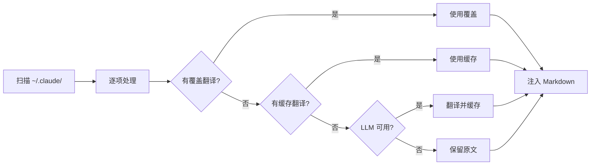
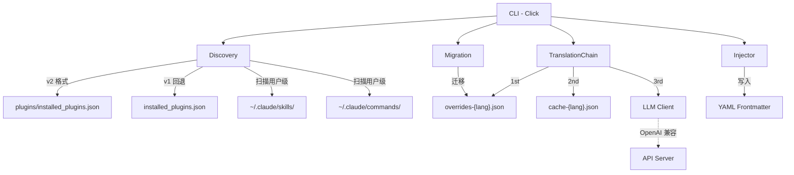

<div align="center">

# Claude Translator

**Claude Code 插件描述多语言翻译工具**

[](LICENSE) [](CHANGELOG.md) [](https://www.python.org/)

[English](README.md) | [中文](README.zh-CN.md) | [日本語](README.ja.md) | [한국어](README.ko.md)

</div>

## 为什么需要 Claude Translator？

Claude Code 有数百个社区插件——但描述几乎全是英文。如果你的团队使用中文、日文或韩文，每天都在阅读未翻译的描述。

Claude Translator 一键解决：**扫描 → 翻译 → 注入**，自动完成。一条命令，所有插件描述变成你的语言。

## 它做了什么

翻译前：

```yaml
---
name: brainstorm
description: Brainstorm ideas collaboratively
---
# Brainstorm
```

翻译后：

```yaml
---
name: brainstorm
description: 协作式头脑风暴创意生成
---
# Brainstorm
```

原始英文保留，翻译后的描述直接注入 frontmatter——Claude Code 立即生效。

## 工作原理



## 快速开始

### 1. 安装

```bash
git clone https://github.com/debug-zhuweijian/claude-translator.git
cd claude-translator
pip install .
```

验证安装：

```
$ claude-translator --version
claude-translator, version 0.1.0
```

### 2. 初始化

设置目标语言。这会创建 `~/.claude/translations/config.json`：

```bash
$ claude-translator init --lang zh-CN
Created config at C:\Users\you\.claude\translations\config.json (target: zh-CN)
```

### 3. 发现

查看可翻译的内容。同时扫描**用户级**技能/命令和**已安装插件**：

```
$ claude-translator discover
Scanning C:\Users\you\.claude ...
Found 440 translatable items (target: zh-CN)
  ok [user] user.skill:academic-writing
  ok [user] user.skill:brainstorming
  ok [user] user.command:commit
  ok [plugin] plugin.superpowers.skill:brainstorm
  ok [plugin] plugin.superpowers.skill:tdd-guide
  ok [plugin] plugin.compound-engineering.skill:code-review
  ok [plugin] plugin.everything-claude-code.agent:build-error-resolver
  ok [plugin] plugin.everything-claude-code.skill:e2e
  ...
```

每行显示：状态（`ok` = 有 frontmatter，`no` = 缺失）、范围（`[user]` 或 `[plugin]`）、规范 ID。

### 4. 翻译

执行翻译。每项使用 4 级回退——覆盖、缓存、LLM、原文：

```
$ claude-translator sync
Scanning C:\Users\you\.claude ...
Translating 440 items to zh-CN ...
  [override] plugin.codex.agent:codex-rescue
  [cache] plugin.superpowers.skill:brainstorm
  [llm] plugin.compound-engineering.skill:code-review
  [llm] plugin.everything-claude-code.agent:build-error-resolver
  [skip] user.skill:my-custom-skill
  ...
Sync complete.
```

状态标签说明：
- `[override]` — 来自手动 `overrides-zh-CN.json`
- `[cache]` — 之前 LLM 已翻译，保存在 `cache-zh-CN.json`
- `[llm]` — 本次由 LLM 新翻译，翻译后自动缓存
- `[skip]` — 无需更改（已翻译或为空）

### 5. 验证

同步后检查覆盖率：

```
$ claude-translator verify
  MISSING: plugin.new-tool.skill:deploy
Coverage: 439/440 (99.8%) — 1 missing
```

## 配置

### 配置级联

```
CLI 参数  >  环境变量  >  config.json  >  默认值
```

### 环境变量

| 变量 | 用途 | 备选 |
|------|------|------|
| `CLAUDE_TRANSLATE_LANG` | 目标语言 | 配置文件或 `zh-CN` |
| `CLAUDE_TRANSLATE_LLM_BASE_URL` | API 地址 | `OPENAI_BASE_URL` |
| `CLAUDE_TRANSLATE_LLM_API_KEY` | API 密钥 | `OPENAI_API_KEY` |
| `CLAUDE_TRANSLATE_LLM_MODEL` | 模型名称 | `OPENAI_MODEL` 或 `gpt-4o-mini` |

### 数据文件

所有数据存储在 `~/.claude/translations/` 下：

| 文件 | 用途 |
|------|------|
| `config.json` | 配置文件（由 `init` 创建） |
| `overrides-zh-CN.json` | 人工翻译覆盖（最高优先级） |
| `cache-zh-CN.json` | LLM 翻译缓存 |

### 使用本地模型

没有 OpenAI 密钥？使用本地模型：

```bash
# Ollama
export CLAUDE_TRANSLATE_LLM_BASE_URL="http://localhost:11434/v1"
export CLAUDE_TRANSLATE_LLM_API_KEY="ollama"
export CLAUDE_TRANSLATE_LLM_MODEL="qwen2.5:7b"

# vLLM
export CLAUDE_TRANSLATE_LLM_BASE_URL="http://localhost:8000/v1"
export CLAUDE_TRANSLATE_LLM_MODEL="Qwen/Qwen2.5-7B-Instruct"
```

### 人工覆盖

编辑 `~/.claude/translations/overrides-zh-CN.json` 修正任意翻译：

```json
{
  "plugin.superpowers.skill:brainstorm": "协作式头脑风暴创意生成"
}
```

覆盖翻译优先级最高——`sync` 永远不会覆盖它。

## 扫描范围

| 来源 | 路径 | 示例 |
|------|------|------|
| 用户技能 | `~/.claude/skills/**/*.md` | `SKILL.md`、`my-skill.md` |
| 用户命令 | `~/.claude/commands/**/*.md` | `commit.md`、`review.md` |
| 插件技能 | `<plugin>/skills/**/*.md` | 各插件的技能定义 |
| 插件命令 | `<plugin>/commands/**/*.md` | 各插件的斜杠命令 |
| 插件 Agent | `<plugin>/agents/**/*.md` | 各插件的 Agent 定义 |

插件注册表从 `~/.claude/plugins/installed_plugins.json`（v2 格式）读取，回退到 `~/.claude/installed_plugins.json`（v1 格式）。多版本插件自动去重——只翻译最新版本。

## 功能特性

| 特性 | 说明 |
|------|------|
| **自动发现** | 扫描 `~/.claude/` 下所有插件、技能、命令和 Agent |
| **4 级回退** | 用户覆盖 → 缓存翻译 → LLM 翻译 → 原文 |
| **人工覆盖** | 通过 `overrides-{lang}.json` 精调任意翻译 |
| **多版本去重** | 同一插件多个版本？只翻译最新版 |
| **CJK 支持** | 内置中文、日文、韩文脚本检测 |
| **OpenAI 兼容** | 支持 OpenAI、Ollama、vLLM 等任何兼容 API |
| **换行安全** | Windows 下保留 CRLF，不破坏文件 |
| **旧版迁移** | 首次运行自动迁移旧格式翻译数据 |
| **配置级联** | CLI 参数 → 环境变量 → 配置文件 → 默认值 |

## CLI 命令参考

| 命令 | 说明 |
|------|------|
| `init --lang LANG` | 创建配置，指定目标语言 |
| `discover [--lang LANG]` | 列出可翻译项及状态 |
| `sync [--lang LANG]` | 执行翻译并写入文件 |
| `verify [--lang LANG]` | 检查覆盖率，报告缺失项 |

## 架构



## 支持的语言

支持 LLM 能处理的任何语言。内置 prompt 模板：

英语 → 中文（简体/繁体） / 日语 / 韩语，中文 → 日语 / 韩语

## 开发

```bash
pip install -e ".[dev]"
python -m pytest tests/ -v
ruff check src/ tests/
```

## 许可证

[MIT](LICENSE)
