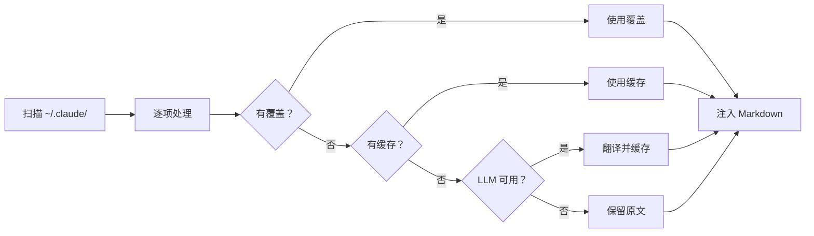
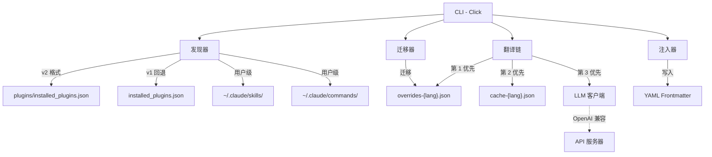

<div align="center">

# Claude Translator

**Claude Code 多语言插件描述翻译工具**

[](LICENSE) [](CHANGELOG.md) [](https://www.python.org/) [](https://github.com/debug-zhuweijian/claude-translator/releases)

**[English](README.md)** | **[中文](README.zh-CN.md)** | **[日本語](README.ja.md)** | **[한국어](README.ko.md)**

</div>

---

Claude Code 有数百个社区插件——但它们的描述几乎全是英文。如果你的团队使用中文、日文或韩文工作，每天都在阅读未翻译的描述。

Claude Translator 解决了这个问题：**扫描 -> 翻译 -> 注入**，全自动。一条命令，所有插件描述变成你的语言。

## 目录

- [为什么需要 Claude Translator？](#为什么需要-claude-translator)
- [功能演示](#功能演示)
- [工作原理](#工作原理)
- [前置条件](#前置条件)
- [快速开始](#快速开始)
- [使用演练：从安装到完整翻译](#使用演练从安装到完整翻译)
- [配置](#配置)
- [扫描范围](#扫描范围)
- [功能特性](#功能特性)
- [CLI 参考](#cli-参考)
- [架构](#架构)
- [支持的语言](#支持的语言)
- [更新日志](#更新日志)
- [开发](#开发)
- [贡献](#贡献)
- [许可证](#许可证)

## 为什么需要 Claude Translator？

**问题所在：** 你安装了 50 多个 Claude Code 插件，每个插件的 `description` 字段都是英文。当 Claude Code 选择使用哪个插件时，它会读取该描述。如果描述是你不熟悉的语言，你就会丢失上下文。如果你使用 CJK 语言工作，这是日常的摩擦点。

**解决方案：** Claude Translator 扫描 `~/.claude/` 目录中的每个插件、skill、command 和 agent，将描述翻译成你的目标语言，并直接注入 Markdown frontmatter。无需手动编辑，无需管理文件。只需运行 `sync`，一切自动翻译。

**它不做的事：** 不会翻译 skill 或 agent 的完整内容——只翻译 YAML frontmatter 中的 `description` 字段。这是 Claude Code 用于插件选择和展示的字段。

## 功能演示

翻译前：

```yaml
---
name: brainstorm
description: Brainstorm ideas collaboratively
---
# Brainstorm
```

翻译后：

```yaml
---
name: brainstorm
description: 协作式头脑风暴创意生成
---
# Brainstorm
```

原始英文被保留。翻译后的描述直接注入 frontmatter——Claude Code 在下次调用时即刻生效。

## 工作原理



对于每个发现的条目，翻译链按顺序尝试四个来源：

1. **用户覆盖**——你在 `overrides-{lang}.json` 中的手动翻译（最高优先级）
2. **缓存**——之前由 LLM 翻译并存储在 `cache-{lang}.json` 中的结果
3. **LLM**——调用配置的模型进行翻译，然后缓存结果
4. **原文**——如果没有 LLM 可用，保留英文文本

## 前置条件

| 依赖 | 版本 | 安装方式 | 验证命令 |
|------|------|----------|----------|
| Python | 3.10+ | [python.org](https://www.python.org/) 或 `winget install Python.Python.3.12` | `python --version` |
| pip | 最新版 | 随 Python 附带 | `pip --version` |
| LLM API key | 任意 | OpenAI、Ollama、vLLM 或任何 OpenAI 兼容端点 | -- |

> **没有 OpenAI 密钥？** Claude Translator 支持通过 Ollama 或 vLLM 使用本地模型。参见下方[使用本地模型](#使用本地模型)。

## 快速开始

### 1. 安装

```bash
git clone https://github.com/debug-zhuweijian/claude-translator.git
cd claude-translator
pip install .
```

验证：

```
$ claude-translator --version
claude-translator, version 0.1.1
```

### 2. 初始化

设置目标语言。此命令会创建 `~/.claude/translations/config.json`：

```bash
$ claude-translator init --lang zh-CN
Created config at C:\Users\you\.claude\translations\config.json (target: zh-CN)
```

### 3. 发现

查看哪些内容可以被翻译。此命令扫描用户级 skill/command 和已安装的插件：

```
$ claude-translator discover
Scanning C:\Users\you\.claude ...
Found 440 translatable items (target: zh-CN)
  ok [user] user.skill:academic-writing
  ok [user] user.skill:brainstorming
  ok [user] user.command:commit
  ok [plugin] plugin.superpowers.skill:brainstorm
  ok [plugin] plugin.superpowers.skill:tdd-guide
  ok [plugin] plugin.compound-engineering.skill:code-review
  ok [plugin] plugin.everything-claude-code.agent:build-error-resolver
  ok [plugin] plugin.everything-claude-code.skill:e2e
  ...
```

每行显示：状态（`ok` = 有 frontmatter，`no` = 缺失）、范围（`[user]` 或 `[plugin]`）和规范 ID。

### 4. 翻译

运行翻译。每个条目使用 4 级回退机制：

```
$ claude-translator sync
Scanning C:\Users\you\.claude ...
Translating 440 items to zh-CN ...
  [override] plugin.codex.agent:codex-rescue
  [cache] plugin.superpowers.skill:brainstorm
  [llm] plugin.compound-engineering.skill:code-review
  [llm] plugin.everything-claude-code.agent:build-error-resolver
  [skip] user.skill:my-custom-skill
  ...
Sync complete.
```

标签说明：
- `[override]`——来自手动 `overrides-zh-CN.json`
- `[cache]`——之前由 LLM 翻译，保存在 `cache-zh-CN.json` 中
- `[llm]`——由 LLM 新翻译，已缓存
- `[skip]`——无需更改（已翻译或为空）

### 5. 验证

同步后检查覆盖率：

```
$ claude-translator verify
  MISSING: plugin.new-tool.skill:deploy
Coverage: 439/440 (99.8%) -- 1 missing
```

---

## 使用演练：从安装到完整翻译

### 场景：你在 Windows 上刚配置好 Claude Code 和 50 个插件

你安装了 Claude Code，添加了研究、写作和开发相关的插件。一切正常，但所有插件描述都是英文。你希望它们变成中文以便更快阅读。

#### 第 1 步：安装和初始化

```
C:\Users\you> git clone https://github.com/debug-zhuweijian/claude-translator.git
C:\Users\you> cd claude-translator
C:\Users\you\claude-translator> pip install .

C:\Users\you\claude-translator> claude-translator init --lang zh-CN
Created config at C:\Users\you\.claude\translations\config.json (target: zh-CN)
```

配置文件告诉 claude-translator 你的目标语言。`init` 只需运行一次。

#### 第 2 步：查看你有什么

```
C:\Users\you\claude-translator> claude-translator discover
Scanning C:\Users\you\.claude ...
Found 440 translatable items (target: zh-CN)
  ok [user] user.skill:academic-writing
  ok [user] user.command:commit
  ok [plugin] plugin.superpowers.skill:brainstorm
  ok [plugin] plugin.superpowers.skill:tdd-guide
  ...
```

共 440 个条目，涵盖用户 skill、用户 command 和已安装插件。`ok` 状态表示该条目有包含 `description` 字段的 frontmatter，已准备好进行翻译。

#### 第 3 步：配置 LLM

如果你有 OpenAI API 密钥，它会自动从 `OPENAI_API_KEY` 读取。如果你使用本地模型：

```
C:\Users\you\claude-translator> set CLAUDE_TRANSLATE_LLM_BASE_URL=http://localhost:11434/v1
C:\Users\you\claude-translator> set CLAUDE_TRANSLATE_LLM_API_KEY=ollama
C:\Users\you\claude-translator> set CLAUDE_TRANSLATE_LLM_MODEL=qwen2.5:7b
```

#### 第 4 步：运行翻译

```
C:\Users\you\claude-translator> claude-translator sync
Scanning C:\Users\you\.claude ...
Translating 440 items to zh-CN ...
  [llm] plugin.superpowers.skill:brainstorm
  [llm] plugin.superpowers.skill:tdd-guide
  [llm] plugin.compound-engineering.skill:code-review
  [llm] plugin.everything-claude-code.agent:build-error-resolver
  [llm] plugin.everything-claude-code.skill:e2e
  ...
Sync complete.
```

每个条目通过 LLM 翻译并缓存。下次运行时，缓存的条目会被复用——只有新增或更改的条目才会调用 LLM。

#### 第 5 步：修正翻译

LLM 将 "brainstorm" 翻译成了 "头脑风暴"，但你更喜欢 "协作式头脑风暴创意生成"。编辑覆盖文件：

`C:\Users\you\.claude\translations\overrides-zh-CN.json`：

```json
{
  "plugin.superpowers.skill:brainstorm": "协作式头脑风暴创意生成"
}
```

再次运行 `sync`：

```
C:\Users\you\claude-translator> claude-translator sync
  [override] plugin.superpowers.skill:brainstorm
  ...
```

你的覆盖具有最高优先级，后续的 sync 永远不会覆盖它。

#### 第 6 步：验证所有内容已翻译

```
C:\Users\you\claude-translator> claude-translator verify
Coverage: 440/440 (100.0%) -- 0 missing
```

所有插件描述现在都是中文。Claude Code 将立即使用翻译后的描述。

### 快速参考表

| 我想要... | 命令 |
|-----------|------|
| 首次设置 | `claude-translator init --lang zh-CN` |
| 查看可翻译内容 | `claude-translator discover` |
| 翻译所有内容 | `claude-translator sync` |
| 检查是否有遗漏 | `claude-translator verify` |
| 修正某个翻译 | 编辑 `overrides-zh-CN.json`，然后 `sync` |
| 切换目标语言 | `claude-translator sync --lang ja` |

---

## 配置

### 配置优先级

```
CLI 参数  >  环境变量  >  config.json  >  默认值
```

### 环境变量

| 变量 | 用途 | 回退值 |
|------|------|--------|
| `CLAUDE_TRANSLATE_LANG` | 目标语言 | 配置文件或 `zh-CN` |
| `CLAUDE_TRANSLATE_LLM_BASE_URL` | API 端点 | `OPENAI_BASE_URL` |
| `CLAUDE_TRANSLATE_LLM_API_KEY` | API 密钥 | `OPENAI_API_KEY` |
| `CLAUDE_TRANSLATE_LLM_MODEL` | 模型名称 | `OPENAI_MODEL` 或 `gpt-4o-mini` |

### 数据文件

所有文件存储在 `~/.claude/translations/`：

| 文件 | 用途 |
|------|------|
| `config.json` | 配置（由 `init` 创建） |
| `overrides-zh-CN.json` | 你的手动翻译（最高优先级） |
| `cache-zh-CN.json` | LLM 翻译缓存 |

### 使用本地模型

没有 OpenAI 密钥？使用本地模型：

```bash
# Ollama
export CLAUDE_TRANSLATE_LLM_BASE_URL="http://localhost:11434/v1"
export CLAUDE_TRANSLATE_LLM_API_KEY="ollama"
export CLAUDE_TRANSLATE_LLM_MODEL="qwen2.5:7b"

# vLLM
export CLAUDE_TRANSLATE_LLM_BASE_URL="http://localhost:8000/v1"
export CLAUDE_TRANSLATE_LLM_MODEL="Qwen/Qwen2.5-7B-Instruct"
```

### 手动覆盖

编辑 `~/.claude/translations/overrides-zh-CN.json` 来修正任何翻译：

```json
{
  "plugin.superpowers.skill:brainstorm": "协作式头脑风暴创意生成"
}
```

覆盖始终具有最高优先级——`sync` 永远不会覆盖它们。

## 扫描范围

| 来源 | 路径 | 示例 |
|------|------|------|
| 用户 skill | `~/.claude/skills/**/*.md` | `SKILL.md`、`my-skill.md` |
| 用户 command | `~/.claude/commands/**/*.md` | `commit.md`、`review.md` |
| 插件 skill | `<plugin>/skills/**/*.md` | 各插件的 skill 定义 |
| 插件 command | `<plugin>/commands/**/*.md` | 各插件的斜杠命令 |
| 插件 agent | `<plugin>/agents/**/*.md` | 各插件的 agent 定义 |

插件注册表从 `~/.claude/plugins/installed_plugins.json`（v2 格式）读取，回退到 `~/.claude/installed_plugins.json`（v1 格式）。多版本插件会自动去重——只翻译最新版本。

## 功能特性

| 功能 | 说明 |
|------|------|
| **自动发现** | 扫描 `~/.claude/` 中的所有插件、skill、command 和 agent |
| **4 级回退** | 用户覆盖 -> 缓存翻译 -> LLM 翻译 -> 原始文本 |
| **手动覆盖** | 通过 `overrides-{lang}.json` 精细调整任何翻译 |
| **多版本去重** | 同一插件的不同版本？只翻译最新版 |
| **CJK 支持** | 内置中文、日文、韩文脚本检测 |
| **OpenAI 兼容** | 支持 OpenAI、Ollama、vLLM 或任何兼容 API |
| **CRLF 安全** | 在 Windows 上保留行尾符——无文件损坏 |
| **BOM 安全** | 保留 Windows 编辑器添加的 UTF-8 BOM 标记 |
| **遗留数据迁移** | 首次运行时自动迁移旧格式翻译数据 |
| **配置优先级链** | CLI 参数 -> 环境变量 -> 配置文件 -> 默认值 |

## CLI 参考

| 命令 | 说明 |
|------|------|
| `init --lang LANG` | 创建配置并设置目标语言 |
| `discover [--lang LANG]` | 列出可翻译条目及其状态 |
| `sync [--lang LANG]` | 翻译描述并写入文件 |
| `verify [--lang LANG]` | 检查覆盖率，报告遗漏条目 |

## 架构



## 支持的语言

支持你的 LLM 支持的任何语言。内置以下方向的提示词：

英文 -> 中文（简体/繁体） / 日文 / 韩文，中文 -> 日文 / 韩文

## 更新日志

### v0.1.1

- **多行 frontmatter 解析**——续行（缩进行）现在会被正确捕获，不再被静默丢弃
- **引号去除**——`"quoted"` 和 `'quoted'` 的 frontmatter 值会被正确去引号
- **UTF-8 BOM 保留**——带有 BOM 前缀的文件在注入后不再丢失 BOM
- **插件发现修复**——修正了注册表路径（`~/.claude/plugins/`）和 v2 格式解析

### v0.1.0

初始发布，包含 4 个 CLI 命令、自动发现、4 级回退、CJK 支持和 OpenAI 兼容客户端。详见 [CHANGELOG.md](CHANGELOG.md)。

## 开发

```bash
pip install -e ".[dev]"
python -m pytest tests/ -v
ruff check src/ tests/
```

## 贡献

欢迎贡献。

**报告 Bug：**
1. 创建一个带有 `bug` 标签的 issue
2. 描述发生了什么、你期望的结果，以及你的环境（操作系统、Python 版本）

**建议功能：**
1. 创建一个带有 `enhancement` 标签的 issue
2. 描述使用场景以及现有功能为何无法满足需求

**提交修复：**
1. Fork 本仓库
2. 创建分支：`git checkout -b fix/your-fix`
3. 提交 PR 并附上清晰的变更描述

## 许可证

[MIT](LICENSE) -- Copyright (c) 2025 debug-zhuweijian
